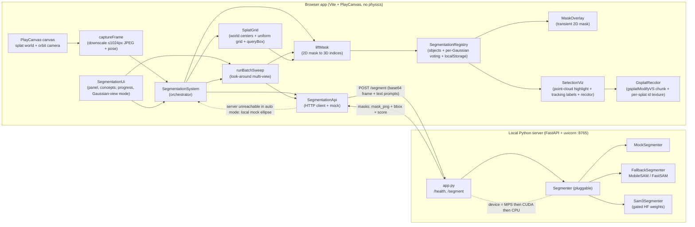
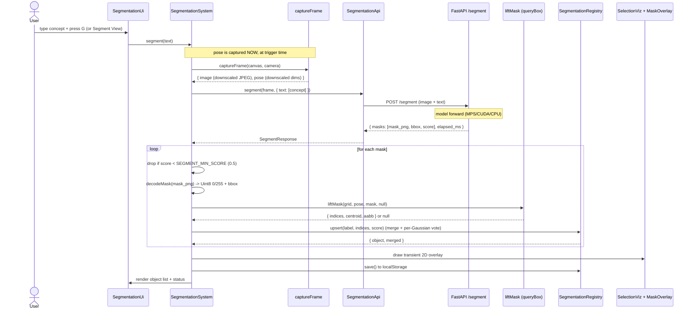
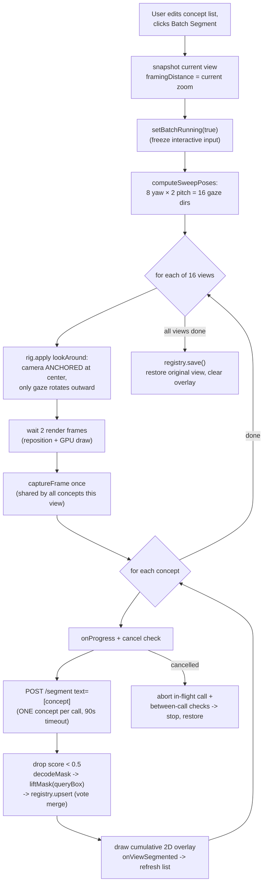
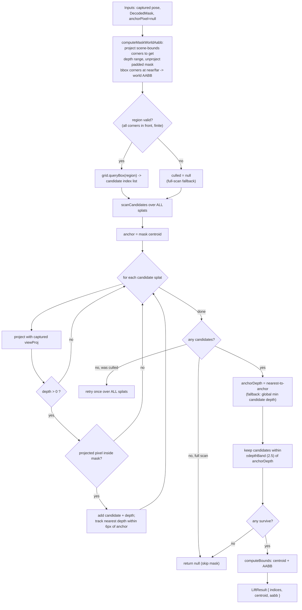
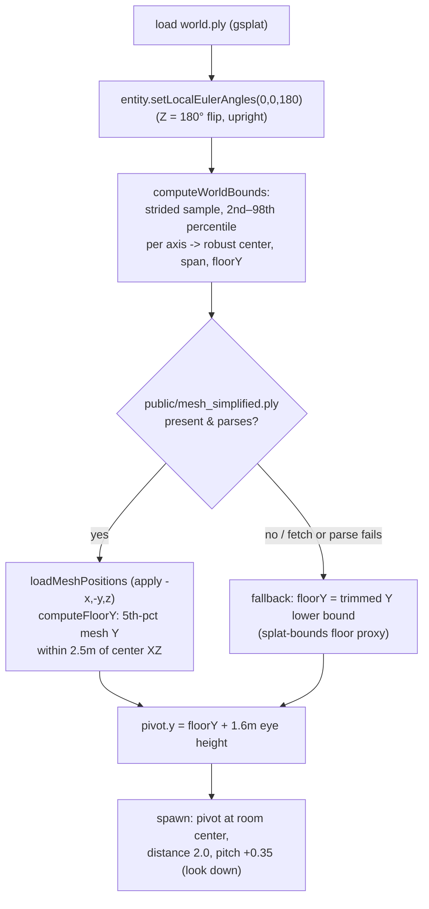
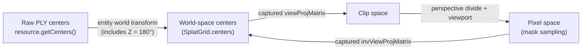

# Architecture — On-Demand Object Segmentation in a Gaussian-Splat World

**Splat Segmenter** renders a multi-million-Gaussian splat scene in PlayCanvas and lets you
segment objects (sofa, chair, cup, pillow…) **on demand**. Each 2D mask from a local SAM
server is **lifted** into the 3D splats, where it becomes a persistent, world-locked,
selectable object that you can re-highlight, frame from any angle, and **recolor or isolate at
the Gaussian level**.

The core insight: the scene is **static**, so segmentation is **"segment once, reuse
forever"** rather than per-frame. You trigger a segment, the server runs a single SAM forward
on the current rendered frame, the client lifts the resulting mask onto the splats it covers,
and stores the per-Gaussian evidence. From then on the object lives in 3D — no further
inference.

> The splat worlds (`world.ply`) and optional collision meshes (`mesh_simplified.ply`)
> described below are generated and exported with **[SpAItial AI](https://app.spaitial.ai)**.

> **Scope.** The viewer is a generic, swap-the-file splat viewer with **no physics, no
> Rapier, no collision-mesh runtime dependency**. The camera is an **orbit/zoom/pan rig
> around a movable pivot**. The runtime splat is a single file `public/world.ply`
> (`SPLAT_URL`). An **optional** `public/mesh_simplified.ply` is loaded **only at startup to
> derive the floor height** for the initial camera, then discarded — if it's missing (e.g. a
> fork that brings only its own splat; both `.ply` files are gitignored), the spawn grounds on
> the splat bounds instead and the app still boots. There is **no scene manifest** — the
> pivot, initial zoom, and grid bounds are derived from the splat centers at runtime. The 3D
> lift anchors depth on the **masked splats themselves**, not on a collision raycast.

---

## 1. Overview & design rationale

The segmentation model (SAM) is heavy on Apple Silicon. The research report
[`docs/research/sam3-realtime-segmentation.md`](./research/sam3-realtime-segmentation.md)
quantifies why a live per-frame loop is a dead end on a Mac and why "lift to 3D once" is the
right architecture:

- **SAM3 is the right model for the task** — open-vocabulary "segment all instances of
  `<noun>`" (Promptable Concept Segmentation). But it is a ~0.86B-param model: ~30 ms/image
  on an NVIDIA H200, but **seconds/image on Apple MPS** (the report cites ~6.5 s/image on an
  M2, PR #400). Its **video/tracking path is CUDA-only** and unavailable on Mac.
- SAM3 weights are **gated** on HuggingFace (license acceptance + `hf auth login`, ~3.4 GB
  F32 download).
- Real-time streaming is impossible on a Mac, but the scene is **static**, so the report's
  recommended architecture (Option A) is **lift 2D masks into the Gaussians once, then
  runtime segmentation is essentially free** — view-consistent, no per-frame jitter. This
  project implements an **interactive, on-demand** variant: the lift happens the moment you
  ask (a `G` press with a concept), plus an optional one-time **Batch Sweep** that
  auto-segments a concept list across 16 views.

Design consequences that shape the whole system:

| Decision | Why |
|---|---|
| **On-demand, not per-frame** | SAM is seconds/image on MPS; a live loop is not viable on Mac. |
| **Lift once into 3D** | Static scene ⇒ a lifted object is valid for all future camera angles. |
| **Concept-only prompts** | SAM3's strength is open-vocab text ("segment all chairs"). There is **no point/click prompt path** in the UI — every segment is a typed concept. |
| **Local Python server** | SAM3 / ultralytics need PyTorch + MPS; can't run in-browser. The browser talks to it over HTTP. |
| **Depth anchored on splats** | The masked Gaussians *are* the geometry; the collision mesh was a coarse floor/wall proxy with no furniture, so it gave useless depths. |
| **Per-Gaussian voting merge** | The same object seen from multiple views merges by per-splat vote/score, pruning splats only one noisy view grabbed. |
| **True gsplat recolor** | Beyond the point-cloud overlay, the actual Gaussians can be tinted/dimmed/hidden by object via a splat shader-chunk override. |
| **Pluggable backends** | `mock` (no deps) → `mobile_sam`/`fallback` (no gated weights) → `sam3` (gated). Pick via `SAM_MODEL`. |
| **No manifest, no physics** | Swapping scenes = replacing one `.ply`; bounds/pivot/grid are derived at runtime; the floor mesh is optional. |

---

## 2. High-level component & data-flow diagram



The browser owns everything 3D (splat grid, lift, registry, overlays, recolor). The server is
a thin, stateless mask producer: frame + prompts in, instance masks out. If the server is
unreachable in `auto` mode, the client falls back to a **local mock ellipse** so the UX never
hard-fails.

---

## 3. API contract

Server base URL defaults to `http://localhost:8765` (overridable via `?server=` query param
or `localStorage["segmentation.server"]`). CORS is open for `localhost:5173` and `*`.

### `GET /health`

Lazily builds the segmenter (the first call triggers the model load) and reports capability:

```json
{ "status": "ok", "model": "mock", "device": "mps", "text_supported": true }
```

| Field | Meaning |
|---|---|
| `status` | always `"ok"` if the process is up |
| `model` | the `SAM_MODEL` env value (`mock` \| `mobile_sam` \| `sam3` \| …) |
| `device` | resolved torch device: `mps` → `cuda` → `cpu` |
| `text_supported` | whether the backend accepts text/concept prompts |

The client uses a **1.5 s timeout** (`HEALTH_TIMEOUT_MS`) on health; failure flips `auto`
mode into mock.

### `POST /segment`  (`Content-Type: application/json`)

Request (`SegmentRequest`):

```json
{
  "image": "<base64 JPEG/PNG, optional data: URI prefix is stripped>",
  "width": 1024,
  "height": 576,
  "prompts": {
    "text": ["sofa"],
    "points": [{ "x": 640, "y": 360, "label": 1 }],
    "boxes": [[100, 150, 500, 450]]
  },
  "multimask": false
}
```

- `prompts` and every field inside it are optional. Coordinates are **pixels** in the
  captured frame's (downscaled) resolution.
- The **client only ever sends `text`** — one concept per call (`{ text: [concept] }`). The
  `points` / `boxes` fields are part of the server contract (and the mock honours them) but the
  viewer has no point/click UI, so it never populates them.
- `points[].label`: `1` = foreground, `0` = background.
- `width`/`height` are the **requested output resolution** (the downscaled capture size);
  masks always come back at this size (nearest-neighbour resize).
- The client always sends `multimask: false`.

Response (`SegmentResponse`, HTTP 200):

```json
{
  "masks": [
    {
      "label": "sofa",
      "score": 0.93,
      "mask_png": "<base64 single-channel (L) PNG, values 0 or 255, width×height>",
      "bbox": [120, 200, 640, 540]
    }
  ],
  "width": 1024,
  "height": 576,
  "model": "sam3",
  "elapsed_ms": 5421.3
}
```

- One `mask` object **per detected instance** (a text prompt can yield many).
- `label` is the text phrase for text prompts, else `point_<i>` / `object_<i>`.
- `mask_png` is a grayscale `L`-mode PNG, `0` or `255`, at the requested resolution.
- `bbox` is `[x0, y0, x1, y1]` pixel coordinates.
- `elapsed_ms` is wall-clock for the whole call (decode + inference + encode).

**Empty-prompt behaviour differs by backend:** FastSAM does "segment everything" (capped at
30 masks); **SAM3 returns an empty `masks` array** (its Transformers image path requires a
prompt); mock returns one centered ellipse. The viewer always sends a concept, so it never
hits the empty-prompt path in normal use.

**Errors:** `400` for a bad/undecodable image or base64; `503` for an actionable model/weight
load failure (e.g. gated SAM3 not authenticated) so the server stays up; `500` otherwise. The
client uses a **60 s** default `/segment` timeout (`SEGMENT_TIMEOUT_MS`), raised to **90 s**
per call during a batch sweep (`BATCH_CALL_TIMEOUT_MS`, cold SAM3 headroom).

### Capture downscaling

[`captureFrame`](../src/segmentation/capture.ts) does **not** send the native drawing buffer.
The canvas can be ~2880 px on a Retina display; SAM cost scales with pixel count and base64
size scales with bytes, so the frame is resampled so its **longest edge ≤ `CAPTURE_MAX_DIM`
(1024 px)** and encoded as **JPEG** (`CAPTURE_JPEG_QUALITY = 0.85`) via an `OffscreenCanvas`
(falling back to a detached `<canvas>` when `OffscreenCanvas` is unavailable). Crucially the
**captured pose width/height are set to the downscaled size**, not the native size — masks
come back at that resolution and the lift maps mask pixels ↔ NDC via `pose.width/height`.
Projection matrices are NDC (resolution-independent), so the lift stays exact regardless of the
downscale factor.

### Client mock fallback

`SegmentationApi` has three modes (`?segmentMode=auto|real|mock`, default `auto`):

- `mock` — never touches the network; renders a local ellipse PNG.
- `real` — always uses the server; errors propagate (and a caller-driven abort always
  propagates, even in `auto`, so a cancelled batch never silently degrades to mock).
- `auto` — probes `/health`; if unreachable, transparently uses the local mock ellipse and
  flags the status line as `(mock)`.

The mock response shape is byte-compatible with the real one (`model: "mock-ellipse"`), so the
rest of the pipeline (decode → lift → registry → overlay/highlight/recolor) is identical.

---

## 4. Interactive segment sequence

Triggered by **`G`** (or the **Segment View** button / Enter in the concept input). There is
**no click/point path** — the prompt is always the typed concept, sent as `{ text: [concept] }`.



**Confidence guard.** Before lifting, any returned mask with `score < SEGMENT_MIN_SCORE`
(**0.5**, exported from `batch.ts`) is dropped and counted in the status line ("N below 50%").
This applies to **both** the interactive path and the batch sweep, so a weak/false match never
spawns a 3D object. (The SAM3 server also thresholds at 0.5 internally; this is an extra
client-side guard.)

**Timing subtlety:** the camera **pose is captured at trigger time** and carried through the
async call. SAM may take seconds; the user can keep orbiting. The lift uses the **captured**
`viewProj`/`invViewProj`, not the live camera, so the mask and the splats it selects stay
consistent with the frame that was actually segmented.

The 2D mask overlay drawn here is **transient/live-only** — it is cleared on the next action.
The **persistent** visual is the 3D point-cloud highlight + tracking label, rebuilt from
stored indices when an object is selected (§7), plus the optional gsplat recolor (§9).

---

## 5. Batch Sweep — one-time look-around multi-view segment

A one-shot pass that auto-segments an **editable concept list** across **16 fixed views**
from the grounded room center. This is the on-demand take on the research doc's "render N
views, run SAM3 with text, lift/merge" pipeline.



Key facts (from `batch.ts`):

- **Look-around, not orbit-at-radius.** Every pose sets `lookAround = { eye: center, yaw,
  pitch }`: the camera position is **identical** for all 16 poses (the grounded room center)
  and only its **gaze rotates outward**. This "stand in the center and turn around" sweep
  avoids swinging the camera into the walls of a small room, which a fixed-radius orbit would
  do. `YAW_STEPS = 8`, `PITCH_VALUES = [-0.25, -0.05]` rad (both slightly down — never the
  ceiling), `TOTAL_VIEWS = 16`.
- **One `/segment` call PER CONCEPT per view.** SAM3 runs one model forward per text phrase,
  so a single-concept request stays under the per-call timeout (`BATCH_CALL_TIMEOUT_MS =
  90000`). All per-concept calls in a view share the **same captured frame**, so lifts from
  different concepts stay mutually consistent.
- **Score guard.** Each returned mask below `SEGMENT_MIN_SCORE` (0.5) is skipped before lifting,
  same as the interactive path.
- **Cost model.** `calls = 16 × conceptCount`. The UI estimate uses
  `SAM3_SECONDS_PER_CALL ≈ 13 s` warm: e.g. 8 concepts × 16 views = **128 calls ≈ ~28 min**
  on SAM3, vs **seconds total** on `mobile_sam`. So batch is realistic on `mock`/`mobile_sam`
  and a "leave-it-running" job on SAM3.
- **Progress + cancel + restore.** A progress bar + per-view/per-concept text update via
  `onProgress`. Cancel aborts the in-flight fetch (`AbortController`) and is also checked
  between calls and between views. On finish/cancel/error the original view is restored and
  the transient overlay cleared; results are always saved.

---

## 6. The 3D lift algorithm

`liftMask` ([`src/segmentation/lift.ts`](../src/segmentation/lift.ts)) turns a 2D mask (plus
the captured pose) into a set of splat indices. Both the interactive path and the batch sweep
call it with `anchorPixel = null` (there is no click point), so the anchor is always the mask
centroid. It **culls candidates with the spatial grid's `queryBox`** before projecting,
instead of scanning all ~2.2M splats.



Step by step:

1. **Region cull (`computeMaskWorldAabb`).** A 2D mask only spans a thin cone through the
   world. The function projects the 8 scene-bounds corners to get the camera-space depth
   range, then unprojects the padded mask bbox corners at near & far depth to build a
   conservative world-space AABB enclosing the mask's frustum slab (padded by `depthBand +
   cellSize`). `grid.queryBox` returns only the splats in that AABB's cells. If the math is
   degenerate (a bounds corner behind the camera, NaN unprojection, empty region), it returns
   `null` and the scan falls back to **all** splats so correctness never regresses.
2. **Pick the anchor pixel.** With no click point, it's always the **mask centroid**
   (`maskCentroid`).
3. **Project candidates.** Each candidate world center is multiplied by the captured
   `viewProjMatrix` (`projectWorldPoint`). Splats behind the camera (`depth <= 0`) are dropped.
4. **Mask test.** A splat is a candidate only if its projected pixel falls inside the mask
   (`sampleMask`) — a screen-space membership test.
5. **Find the depth anchor.** Among candidates whose projected pixel is within
   `ANCHOR_PIXEL_RADIUS = 6 px` of the anchor pixel, take the **nearest** view depth. If
   nothing lands near the anchor, fall back to the global minimum candidate depth.
6. **Depth band filter.** Keep only candidates within `±depthBand` (default **2.5** world
   units) of the anchor depth.
7. **Bounds.** `computeBounds` produces the centroid and AABB over the selected indices. If
   the culled scan found nothing, retry once over the whole scene before giving up.

**Why the depth band exists.** A 2D mask is flat — many *background* splats also project
inside the silhouette of, say, a sofa (you see "through" it to the wall behind). Without a
depth gate the lift would grab the wall too. Anchoring depth at the nearest masked splat near
the centroid, then keeping only splats within a band of that depth, isolates the foreground
object's shell from background bleed-through.

**Why splat-based depth (not a collision raycast).** The simplified mesh is a coarse
walls/floor proxy with **no furniture**, so it returned unreliable depths for furniture-scale
objects and the depth band rejected every real splat. Depth comes straight from the splats:
the masked Gaussians *are* the geometry. (The mesh is used **only** for the initial floor
height, and only when present; the lift never touches it.)

---

## 7. Persistence, voting merge, highlight & selection

`SegmentationRegistry` ([`registry.ts`](../src/segmentation/registry.ts)) owns the set of
`SegmentedObject`s; `SelectionViz` ([`viz.ts`](../src/segmentation/viz.ts)) renders them.

### Per-Gaussian confidence voting (the merge)

Each object stores **per-Gaussian evidence**, not a flat index union:

- `candidateIndices` — the SORTED union of every splat ever selected for this object across
  all merged views.
- `voteCounts[k]` — how many views selected `candidateIndices[k]`.
- `scoreSums[k]` — the accumulated mask score that splat received (all splats from one mask
  share that mask's score).
- `splatIndices` — the **final, pruned membership**, derived from the evidence; this is what
  the highlight / recolor / focus framing use.

When a new lift arrives, `findMergeTarget` looks for an existing object that is "the same
thing":

1. **Same label** (case-insensitive, trimmed), **OR**
2. **Index overlap > 25%** (`overlapRatio` = shared / smaller set, vs `MERGE_OVERLAP_RATIO =
   0.25`).

A match folds the new view into the evidence (`mergeVotes`, an O(n+m) sorted merge):
overlapping splats gain a vote and accumulate score; splats new to this object enter with
vote = 1. `sourceViews` increments and `score` takes the max. No match creates a new object
(every splat starts at vote 1) with the next palette color.

`recomputeMembership` then derives `splatIndices` from the evidence under two thresholds:

```
VOTE_THRESHOLD  = 2     // "seen from >= 2 views" → a real surface
SCORE_THRESHOLD = 1.6   // ~two solid (>=0.8) detections of repeated strong evidence
```

A candidate is promoted into the final membership if `voteCounts[k] >= VOTE_THRESHOLD`
**OR** `scoreSums[k] >= SCORE_THRESHOLD`. The OR lets one very-confident streak survive while
a single noisy view (vote = 1, modest score) gets pruned **once a second view votes**.

> **Single-view objects are never pruned.** If `sourceViews < 2` (never merged), membership
> is the full candidate set — a fresh segmentation always shows everything it lifted. Pruning
> only kicks in once a second view votes. And the thresholds never prune an object to *nothing*:
> if they reject everything, it falls back to the full candidate set.

This replaces the old plain set union with proper multi-view voting (the SAGD/SAGS approach in
the research doc), so the same sofa from two angles merges into one **confidence-weighted**
object rather than the union of two noisy masks.

### Storage

Objects persist to `localStorage` under **`segmentation.objects.v2`** (the v2 bump: the
payload now stores the **vote/confidence evidence**, not the derived membership — `idx`
(candidates), `votes`, `scores`, each as base64 of the typed-array bytes — plus `label`,
`color`, `sourceViews`, `score`). `load()` guards on `v === 2` (v1 blobs are ignored) and
**re-derives `splatIndices` + bounds via `recomputeMembership`**, so tweaking the thresholds
re-prunes existing objects on the next reload. The 2D mask is **not** stored — only evidence.

**Selection** persists separately under **`segmentation.selected.v2`** as a **JSON array of
ids** (v2: multi-select; v1 was a single id string). The model is **many selected objects at a
time**: clicking a list row **toggles** the object in/out of the selection (lights up or clears
its splats); the per-row **⤢ focus** control reframes the camera on one object **without
changing the selection**. On reload the selection is **restored as highlights only** (no camera
jump on boot) for objects that still exist.

### Visuals (three layers)

- **2D mask overlay** (`MaskOverlay`) — a `<canvas>` layered over the splat view, painted on
  segment/batch with each mask scaled up (nearest-neighbour) from the downscaled capture
  resolution. **Transient/live-only** — cleared on the next action and after a batch. Object
  *names* are **not** painted here (see tracking labels below).
- **3D point-cloud highlight** (`SelectionViz`) — the **persistent** per-object visual. On
  selection it rebuilds a `PRIMITIVE_POINTS` mesh from the object's stored indices (world-space
  centers), rendered with a custom `ShaderMaterial` (round points, size 6, object color). One
  highlight entity per selected id, each in its own color (multi-select). **There is no AABB
  wireframe** — the point cloud is the sole 3D highlight.
- **Tracking labels** — one DOM `<div>` per selected object, anchored to the object's 3D
  centroid and **repositioned every frame** by projecting the centroid with the camera's
  view-projection, so the name tag follows the object as the camera orbits/moves. Labels hide
  when the centroid is behind the camera or off-screen.

Plus the optional **gsplat recolor** of the actual Gaussians (§9), driven from the same
selection.

**Render-layer trick.** Gaussian splats render in their own blend pass and would paint over
the highlight points in the World layer. `SelectionViz` creates a **dedicated overlay layer**
pushed *after* the gsplat pass, drawn by the camera last, with the point material set
`depthTest = false` / `depthWrite = false`. Splats don't write a depth the points can test
against, so always-on-top is what reliably "lights up" the object.

**Subsample cap.** The highlight point cloud is capped at `HIGHLIGHT_POINT_CAP = 40_000`
points (uniform stride over the sorted index list), so a 300k-splat object still
uploads/draws cheaply while keeping its shape readable.

`SegmentationRegistry` also exposes `selectUnderCursor` (ray/AABB picking via a captured
`invViewProj`), but it is **not wired to any input** — selection is via list-row clicks only.

---

## 8. Camera, controls & coordinate spaces

### Camera rig (`main.ts`)

An **orbit/zoom/pan viewer** around a movable `pivot` (no physics):

| Input | Action |
|---|---|
| **Drag** (pointer-lock, canvas-only) | orbit yaw/pitch around the pivot |
| **Wheel** | zoom (`distance`, clamped `1.5`–`150`, scaled by current distance) |
| **W A S D / arrows** | pan the pivot in the ground plane (relative to yaw) |
| **Q / E** | lower / raise the pivot |
| **G** | segment the typed concept (text prompt) |

Input guards matter: `pc.Mouse` listens on `window`, so an orbit only starts when the press
**lands on the canvas** (otherwise clicking HUD/panel buttons would steal the cursor via
pointer lock). Camera input and pan are frozen while a batch sweep runs. There is no canvas
click handler for segmentation — the only segment trigger is `G` / the Segment View button.

Each frame, `updateCamera` recomputes the camera position. In the normal orbit it's a
spherical offset from the pivot with `lookAt(pivot)`. When `lookAround` is set (batch sweep),
the camera stays **at the eye point** and only its gaze rotates outward.

### Initial spawn (floor-grounded, mesh optional)



- **Robust center.** Splat scenes have stray "floater" splats that inflate the raw AABB.
  `computeWorldBounds` strided-samples world-space centers and takes the **2nd–98th
  percentile** midpoint per axis — the room's spatial center, not the density centroid. It also
  returns `floorY` = the **low end of the trimmed Y range** (the splat entity's Z = 180° flip
  puts "up" at larger world Y, so the trimmed minimum is the floor).
- **Floor grounding (mesh present).** `loadMeshPositions` reads the optional
  `mesh_simplified.ply` (positions-only binary-LE PLY reader, applying the same `(-x, -y, z)`
  world flip as the splat's Z = 180° rotation), and `computeFloorY` takes the 5th-percentile
  mesh Y within 2.5 m of the center XZ. Spawn = `floorY + 1.6 m` eye height.
- **Floor grounding (no mesh).** The mesh fetch/parse is wrapped in `try/catch`. If the file
  is missing or fails to parse (the common case for a fork that brings only its own
  `world.ply`), the catch grounds on the **splat-bounds floor proxy** (`bounds.floorY`), so the
  spawn still lands at standing eye height instead of mid-room — **the app boots with only a
  `world.ply`**.
- **Framing.** Spawns zoomed-in (`INITIAL_DISTANCE = 2.0`) with a slight downward pitch
  (`INITIAL_PITCH = 0.35`).
- **Focus.** `focusOnObject` reframes via the AABB **half-diagonal** and the camera FOV
  (`radius / tan(fov/2) × 1.3`, floored at `2.5`), and aims **from the object toward the room
  interior** so the camera lands in open space looking at the object rather than burying
  itself in the wall behind a corner object.

### Coordinate spaces



| Space | Where it comes from | Used for |
|---|---|---|
| **Raw PLY** | `entity.gsplat.resource.centers` (or `gsplatData.getCenters()`) | Source geometry; never used directly by the lift. Also the **`splat.index` space** the recolor texture is keyed by. |
| **World** | `SplatGrid.fromSplatEntity` bakes `entity.getWorldTransform()` into every raw center once | All lift math, bounds, AABBs, registry storage, highlight points, tracking-label anchors. |
| **Pixel** | `projectWorldPoint(pose, …)` via captured `viewProjMatrix` | Mask membership test in the lift; label projection. |

- The splat entity is created with `setLocalEulerAngles(0, 0, 180)` — a **180° roll about Z**
  (the PLY convention is upside-down relative to PlayCanvas). The optional collision mesh reader
  negates X and Y to land in the same world space.
- **All lift math runs in world space** after that transform is baked in; the lift never
  re-applies the rotation.
- The **Z = 180° flip moves positions but never reorders the splat data**, so the linear
  `splat.index` in the gsplat shader lines up 1:1 with the registry's stored indices — which is
  exactly why the recolor texture (§9) can be keyed by `splat.index` with no remap.

---

## 9. True gsplat recolor / isolate

`GsplatRecolor` ([`recolor.ts`](../src/segmentation/recolor.ts)) is the SAGA / Gaussian-Grouping
"endgame": instead of only drawing a point-cloud overlay, it tints / dims / hides the
**underlying Gaussians themselves** for the selected objects. It is driven from the panel's
**Gaussian view** `<select>` with three modes:

| Mode | UI label | Effect |
|---|---|---|
| `off` | **Point highlight** | No change to Gaussians; only the point-cloud overlay (§7) shows. |
| `recolor` | **Recolor + dim rest** | Selected Gaussians tinted toward their object color; everything else dimmed (`DIM_FACTOR = 0.16`). |
| `isolate` | **Isolate selected** | Selected Gaussians kept (tinted); all others discarded via alpha-clip. |

**How it works (PlayCanvas 2.19, non-unified gsplat):**

- PlayCanvas exposes user hooks in the splat vertex shader via the **`gsplatModifyVS` shader
  chunk** (`modifySplatCenter` / `modifySplatRotationScale` / `modifySplatColor`). The engine
  calls `modifySplatColor(center, inout color)` for every Gaussian with the global
  `splat.index` (the linear source-gaussian index) in scope. `GsplatRecolor` overrides this
  chunk (GLSL + a WGSL mirror for WebGPU).
- A per-splat **RGBA8 "selection" texture** (`TEX_WIDTH = 2048`, height derived from splat
  count) is keyed by `splat.index`: `rgb` = object color, `a` = selected flag. The shader does
  `texelFetch(uSegTex, ivec2(idx % w, idx / w))` and branches on the mode + flag.
- The texture is rebuilt only **when the selection changes** (`apply` stamps each selected
  object's color at each of its splat indices, then `lock()/unlock()` re-uploads), never per
  frame. The only per-Gaussian runtime cost is one branch (mode off) or one extra texture fetch
  (mode on) inside a shader that already does several fetches per splat — comfortably real-time
  on the ~2.2M-splat scene.

**Empty-selection guard.** `recolor`/`isolate` with nothing selected would blank or dim the
whole scene (reads as "broken"), so the effective mode falls back to `off` until something is
selected.

The recolor is created lazily in `SelectionViz.setCenters()` once the splat count is known
(the gsplat material may not exist until the asset finishes loading; `GsplatRecolor` acquires
it lazily on first `apply`). It is fully self-contained in the viz layer — missing markup is a
no-op.

---

## 10. Model tiers & how to run

The backend is chosen with the `SAM_MODEL` env var. All three return the same `MaskResult`
shape, so the frontend doesn't care which is running.

| Tier | `SAM_MODEL` | Weights | Prompts | Notes |
|---|---|---|---|---|
| **Mock** | `mock` (default) | none | text / point / box | Deterministic ellipses, zero ML deps. Smoke tests + instant frontend target. |
| **Fallback** | `mobile_sam` \| `sam2` \| `fastsam` \| `fallback` | auto-downloaded, **not gated** | point/box (MobileSAM); text via FastSAM + CLIP | Real masks on MPS. The "it just works" tier. |
| **SAM3** | `sam3` \| `sam3.1` | **gated** (HF license) | text + box (points → ±16 px box) | Open-vocab concept segmentation; ~3.4 GB; seconds/image on MPS. |

> The **viewer only sends text**, so on the fallback tier you're exercising the FastSAM + CLIP
> text path; on SAM3 you're exercising the native open-vocab path. Point/box prompts exist in
> the server contract but the UI never sends them.

### Run the server

```bash
cd server
SAM_MODEL=mock ./run.sh            # http://localhost:8765, no ML deps
```

```bash
# real masks, no gated weights (MobileSAM points/boxes + FastSAM text)
SAM_MODEL=mobile_sam ./run.sh
```

```bash
# gated SAM3 (open-vocab text)
cd server && source .venv/bin/activate
pip install -U "transformers>=5.9" huggingface_hub accelerate torch pillow
# 1) accept the license at https://huggingface.co/facebook/sam3
hf auth login                      # paste an HF token
SAM_MODEL=sam3 ./run.sh            # or SAM_MODEL=sam3.1
```

`run.sh` creates `server/.venv`, installs `requirements.txt`, exports
`PYTORCH_ENABLE_MPS_FALLBACK=1` (so unsupported MPS ops fall back to CPU instead of crashing),
keeps ultralytics/matplotlib caches inside the server dir, and launches uvicorn on `:8765`.

### Real on-Mac latency

- **SAM3 on MPS:** **~13 s/call warm**, **~20 s+ cold** per text phrase (the in-code batch
  estimate uses 13 s; the 90 s per-call timeout covers a cold forward). Each text phrase is a
  separate model forward, which is why the batch issues one call per concept. *(The research
  doc cites ~6.5 s/image on an M2 from upstream PR #400 — a different machine/measurement; the
  in-code ~13 s reflects this project's observed warm cost. See discrepancy note below.)*
- **`mobile_sam` on MPS:** **sub-second per segment** warm; the **first** call pays a cold
  model download + load (tens of seconds, lazy `@lru_cache` segmenter + ultralytics weight
  fetch).
- **`mobile_sam` text path needs CLIP weights** (FastSAM + CLIP). On SSL-restricted networks
  the CLIP download can fail; point/box prompts still work without it (but the UI sends text,
  so on a CLIP-less fallback the text path is the one that breaks).
- SAM3 video/tracking is CUDA-only and unused here.

---

## 11. File / module map

### Frontend (`src/segmentation/` + `main.ts`)

| File | Responsibility (one line) |
|---|---|
| `main.ts` | App bootstrap: load `SPLAT_URL`, `computeWorldBounds` (percentile-trimmed center + span + floorY), **optional** mesh PLY reader + `computeFloorY` grounding with splat-bounds fallback, orbit camera (`updateCamera`, `lookAround`), `focusOnObject`, input binding. |
| `system.ts` | `SegmentationSystem` orchestrator: segment flow (`G`/Segment View, text-only, `SEGMENT_MIN_SCORE` guard), batch start/cancel, **multi-select** toggle + per-object focus, selection persistence (v2), list refresh. |
| `batch.ts` | `runBatchSweep`, `computeSweepPoses` (8×2=16 look-around poses), `estimateBatch` (cost model), per-concept calls, `SEGMENT_MIN_SCORE`, `CameraRig`/`CameraView.lookAround` types. |
| `lift.ts` | `liftMask` — queryBox-culled candidates + project + mask test + depth band (anchor = mask centroid); `computeMaskWorldAabb`, `computeBounds`. |
| `splatIndex.ts` | `SplatGrid` — raw→world centers + uniform spatial grid; `queryBox` region cull, `forEach`, `worldBounds`. |
| `registry.ts` | `SegmentationRegistry` — object store, label/overlap merge with **per-Gaussian voting** (`candidateIndices`/`voteCounts`/`scoreSums`, `recomputeMembership`, thresholds), v2 base64 evidence persistence, ray/AABB picking (unused). |
| `viz.ts` | `SelectionViz` — persistent point-cloud highlight from indices on a dedicated overlay layer (40k cap, ShaderMaterial points), per-frame **DOM tracking labels**, owns `GsplatRecolor` + the Gaussian-view toggle. No AABB box. |
| `recolor.ts` | `GsplatRecolor` — true gsplat recolor/isolate via a `gsplatModifyVS` chunk override (GLSL + WGSL) + a per-splat RGBA8 id texture keyed by `splat.index`; modes off/recolor/isolate. |
| `overlay.ts` | `MaskOverlay` — transient 2D colored mask painting (scratch + nearest-neighbour upscale from capture resolution) on a layered canvas. Names are NOT painted here. |
| `capture.ts` | `captureFrame` (canvas → **downscaled ≤1024px JPEG** + pose at downscaled dims), `projectWorldPoint`, `pixelToWorldRay`. |
| `api.ts` | HTTP client for `/health` + `/segment`, `auto`/`real`/`mock` modes, local mock-ellipse fallback, abort/timeout handling. |
| `ui.ts` | `SegmentationUi` — binds the HTML panel (concept input + Segment View, concept list + estimate, batch progress/cancel, Gaussian-view `<select>`, object list with toggle/focus/delete). |
| `mask.ts` | `decodeMask` (base64 PNG → `Uint8` 0/255 + bbox), `sampleMask`, `maskCentroid`. |
| `types.ts` | Shared interfaces: `CameraPose`, `CapturedFrame`, `DecodedMask`, `SegmentedObject` (with vote/score fields), request/response shapes. |

### Backend (`server/`)

| File | Responsibility (one line) |
|---|---|
| `app.py` | FastAPI app, request/response schema, base64↔image helpers, `/health` + `/segment`, lazy `@lru_cache` segmenter singleton, 400/503/500 errors. |
| `segmenters.py` | `Segmenter` ABC + `MockSegmenter` / `Sam3Segmenter` / `FallbackSegmenter`, device detection (MPS→CUDA→CPU), one forward per text phrase, factory. |
| `requirements.txt` | Core stack always; ML stack (torch/ultralytics) for non-mock; SAM3 (transformers/hf) deps with gated-weight notes. |
| `run.sh` | venv bootstrap + install + uvicorn on `:8765` with MPS fallback enabled. |
| `README.md` | Server quick start, SAM3 enablement steps, API contract, smoke tests. |

---

## 12. Limitations & future work

- **SAM3 is not real-time.** ~13 s/call warm on MPS; the batch sweep on SAM3 is a
  leave-it-running job (~28 min for 8 concepts). `mobile_sam` is sub-second but its text path
  needs CLIP.
- **Concept-only.** There is no point/click prompt path in the UI — you segment by typing a
  noun. Fine for SAM3's open-vocab strength, but you can't disambiguate "this *specific* chair"
  by clicking it.
- **Main-thread lift.** `liftMask` projects on the main thread. `queryBox` culling keeps it to
  the relevant region (a large win over the old full scan), but a very large mask / region is
  still a visible main-thread cost; a Web Worker is the next step.
- **`mobile_sam` text needs CLIP** weights, which can fail to download on SSL-restricted
  networks.
- **"Segment everything" is unsupported by SAM3** (returns an empty array); only FastSAM does
  it (capped at 30). The viewer always sends a concept anyway.
- **Fixed grid cell size** (`CELL_SIZE = 5`) rather than tuned per scene.
- **Voting thresholds are global** (`VOTE_THRESHOLD`, `SCORE_THRESHOLD`), not per-object or
  per-scene tuned; they re-apply on reload, so tuning is a code change + refresh.

---

## 13. Discrepancy notes (code vs prose)

- **SAM3 latency.** The research doc cites **~6.5 s/image on an M2** (upstream PR #400), while
  `batch.ts` uses **~13 s warm / ~20 s cold** for the cost estimate and a 90 s per-call
  timeout. These reflect different machines/measurements; this doc uses the in-code ~13 s as
  the authoritative "on this Mac" figure and cites the research doc's 6.5 s for context.
- **De-branded.** The research doc still refers to the "Moonbase Greenhouse" scene; the
  runtime app is scene-agnostic (`world.ply`, no manifest). The research doc is intentionally
  left as-is.
- **`selectUnderCursor`** ray/AABB picking exists in the registry but is **not wired to any
  input** (there is no canvas click handler at all); selection is via list-row clicks.
- **Point/box prompts** are in the server + client API contract and honoured by the mock, but
  the viewer's UI only ever sends `text`.
